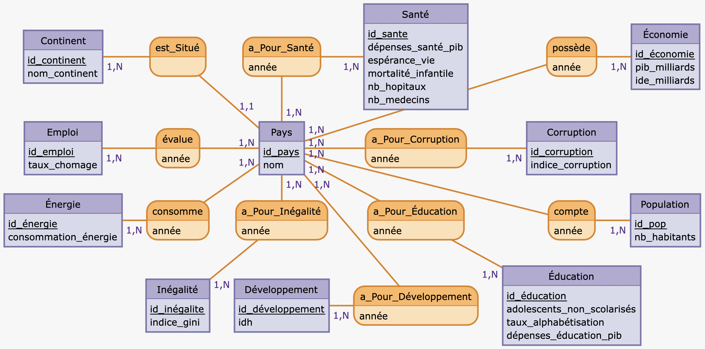
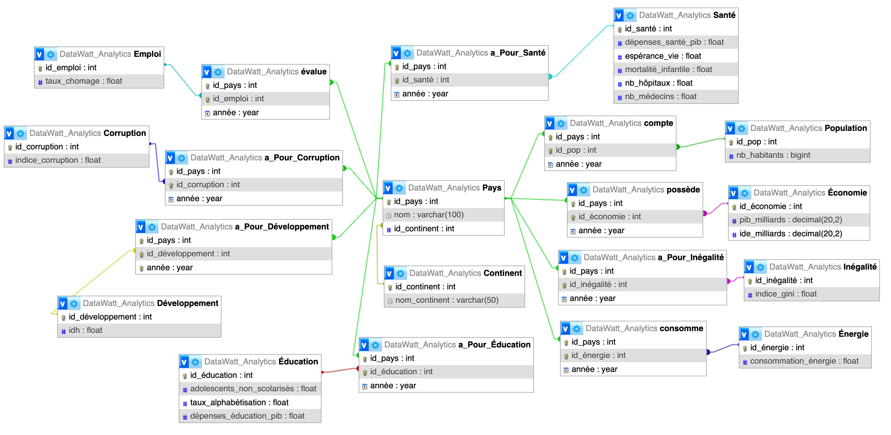
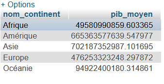
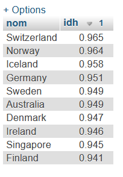
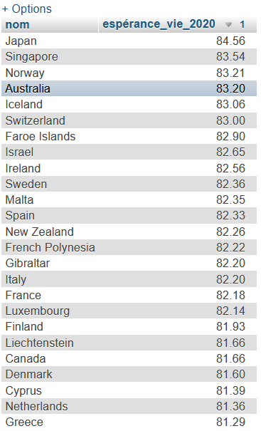
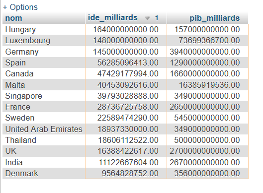
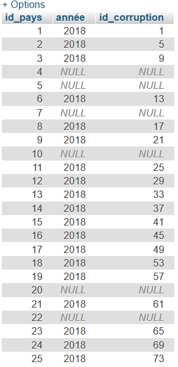

```{r setup, include=FALSE}
knitr::opts_chunk$set(echo = TRUE)
knitr::opts_knit$set(root.dir = "C:/Users/USER/Downloads/DataWatt_extracted/DataWatt_Analytics")
load("C:/Users/USER/Downloads/DataWatt_extracted/DataWatt_Analytics/.RData")
```


# Introduction {.label:s-intro}

## Introduction

De nos jours, les données occupent une place prédominante dans nos vies, souvent sans que nous ne nous en rendions compte. Chaque fait et geste peut être numérisé et transformé en données exploitables. Comme l’a affirmé Peter Sondergaard, "L'information est le pétrole du XXIe siècle, et l'analyse est le moteur à combustion"[^1].  Cette citation souligne que les données n'ont de valeur que si elles sont correctement analysées et mises en perspective. \
C’est pourquoi les gouvernements s’appuient de plus en plus sur des analyses statistiques pour prendre des décisions stratégiques. Par exemple, l'analyse des données économiques comme le PIB et le taux de chômage, associée à des informations sur la santé (comme l'espérance de vie), permet à un gouvernement de décider s'il doit investir davantage dans l'éducation, la santé ou d'autres secteurs pour améliorer le bien-être de sa population. \
C'est dans ce contexte que nous avons choisi de travailler sur la question suivante :

[^1]:https://paperjam.lu/article/donnee-nouvel-eldorado

\medskip

\begin{center}
\textbf{Quels sont les facteurs les plus déterminants du développement d’un pays en fonction de ses indicateurs économiques (PIB, emploi), sociaux (santé, éducation, population) et environnementaux (énergie) ?}
\end{center}

\medskip

Nous cherchons, à travers cette question, à comprendre comment différents indicateurs interagissent pour influencer le développement d’un pays. Pour cela, nous nous appuierons sur l’Indice de développement humain (IDH) comme outil de mesure. En effet, le développement d’un pays ne se limite pas seulement à la croissance économique ; il englobe également des dimensions sociales telles que la réduction des inégalités, l’amélioration de l’accès à l’éducation, ainsi que l’augmentation des opportunités d’emploi. L’objectif final est d’améliorer le bien-être général de la population.

\medskip

Notre analyse vise à identifier les facteurs les plus influents qui contribuent au bon ou au mauvais développement d’un pays et à établir d’éventuels liens entre ces indicateurs. 

\medskip

De plus, notre étude permettra d’examiner l’évolution de ces indicateurs au fil des années. Plus précisément, la période choisie (2018-2021) nous donnera l’occasion d’observer les variations de ces indicateurs pendant la pandémie de COVID-19.

## Responsabilités et composition de l’équipe
\begin{itemize}
\item BEKAKRIA Ahmed : Étudiant n°22412063, collecte des données, requêtes partie SQL, analyse et visualisation des données
\item KHERRAF Soukeyna : Étudiant n°22313318, collecte des données
\item MARCHAL Florient : Étudiant n°22212645, rédaction du rapport, création de la base de données, analyse et visualisation des données
\item SAKINE Mickael : Étudiant n°22306852, nettoyage des données
\end{itemize}

# Base de données

## Provenance des données

La majorité des données utilisées dans ce projet proviennent de la Banque mondiale de données, accessible via le lien suivant : https://data.worldbank.org. Les données qui ne sont pas issues de la Banque mondiale (à savoir l'IDH, l'indice de Gini et la corruption) ont été recueillies sur le site https://ourworldindata.org. Nous avons ensuite constitué notre propre jeu de données en combinant plusieurs indicateurs économiques et sociaux de différents pays, dans le but d'étudier leurs corrélations et de déterminer quels facteurs ont le plus d'impact.

\medskip

Notre base de données se compose de 20 fichiers au format CSV, répartis de la manière suivante :

\begin{itemize}
\item
Les fichiers d’indicateurs utilisés dans cette étude représentent chacun un indicateur spécifique mesuré pour un ensemble de pays. Le nombre de lignes varie entre 299 et 852 selon les fichiers, et celui des colonnes entre 2 et 6. Cette variation s’explique notamment par la source des données : les indicateurs issus du site ourworldindata.org ne comportent pas de cases vides en cas de valeurs manquantes, ce qui réduit le nombre total de lignes. En revanche, les fichiers provenant de la base de données de la Banque mondiale comptent systématiquement 852 lignes. Dans tous les fichiers, la première colonne correspond à un identifiant unique, tandis que les colonnes suivantes contiennent les valeurs mesurées des indicateurs.
\item Les fichiers de correspondance servent à relier chaque donnée à son pays et à son année de référence. Leur structure est la même pour tous les fichiers : ils comportent trois colonnes — l’identifiant du pays, l’identifiant des données et l’année — et un nombre de lignes variable, correspondant exactement à celui du fichier d’indicateur associé. Ces fichiers sont essentiels pour associer correctement chaque valeur d’indicateur au pays et à la période.
\item fichier pays : ce fichier associe chaque pays à un identifiant ainsi qu’à l’identifiant de son continent. Il comprend 213 lignes et 2 colonnes, l'identifiant et le nom du pays.
\item fichier continents : ce fichier fait le lien entre les identifiants de continent et leur nom. Il contient 5 lignes et 2 colonnes.

\end{itemize}

\medskip

Pour chaque table que nous avons récupérée, nous avons choisi de nous limiter à la période allant de 2018 à 2021. Cela nous permet de travailler avec des données relativement récentes, tout en intégrant la période de la pandémie de COVID-19. Cette période particulière nous permettra d’observer comment certains indicateurs ont pu évoluer ou être affectés.
\medskip

La population que nous allons étudier couvre l’ensemble du globe, cela nous permettra d’examiner comment l’impact des différents facteurs varie en fonction de la localisation géographique des pays étudiés.


## Description de nos données

Afin de mieux comprendre à quoi correspondent les chiffres dont nous allons parler, vous trouverez ci-dessous l'explication de nos variables :

\begin{itemize}
\item IDH : Indice de développement humain. Il est basé sur l'espérance de vie, le PIB et le taux d'alphabétisation.
\item Adolescents non scolarisés : Pourcentage  des adolescents en âge de fréquenter le 1er cycle du secondaire qui ne sont pas scolarisés.
\item Taux d'alphabétisation : Taux d’alphabétisation des jeunes de plus de 15 ans.
\item Dépenses pour l'éducation exprimé en pourcentage du PIB : Pourcentage du PIB dépensé dans l'éducation.
\item Indice Gini : Indicateur des inégalités de revenus.
\item Consommation d'énergie : Consommation énergétique totale (unité non précisée).
\item PIB en milliards : Produit intérieur brut en milliards de dollars américains.
\item IDE en  milliards : Investissements directs étrangers en milliards de dollars américains..
\item Dépenses pour la santé exprimé en pourcentage du PIB: Pourcentage du PIB consacré à la santé.
\item Espérance de vie : Espérance de vie à la naissance.
\item Mortalité infantile : Taux de mortalité infantile.
\item Nombre d'hôpitaux : Nombre de lits pour 1000 habitants.
\item Nombre de médecins : Nombre de médecins pour 1000 habitants.
\item Taux de chômage : Pourcentage de la population active sans emploi.
\item Indice de corruption : Contrôle de la corruption (CPI score).

\end{itemize}

## Descriptif des tables

Ci dessous vous trouverez pour chacune de nos tables un courte déscription.

| Nom colonne | Type | Signification | Caractéristique |
|:-----------:|:----:|:-------------:|:---------------:|
|id_pays       |nombre entier|               |clé primaire    |
|id_continent      |nombre entier|               |clé étrangère   |
|nom          |lettres  |nom du pays  |                 |
Table: Pays (213 $\times$ 3)


| Nom colonne | Type | Signification | Caractéristique |
|:-----------:|:----:|:-------------:|:---------------:|
|id_continent| nombre entier     |               |clé primaire|
|nom_continent    | lettres |nom du continent |                 |
Table: Continent (5 $\times$ 2)

| Nom colonne | Type | Signification | Caractéristique |
|:-----------:|:----:|:-------------:|:---------------:|
|id_Pop       | nombre entier     |               |clé primaire  |
|nb_Habitants |nombre entier     |               |données    |
Table: Population (852 $\times$ 2)

| Nom colonne | Type | Signification | Caractéristique |
|:-----------:|:----:|:-------------:|:---------------:|
|id_Pop       | nombre entier     |               |clé étrangère  |
|id_pays      |nombre entier      |               | clé étrangère   |
|année        |date      |               |                 |
Table: compte (852 $\times$ 3)


| Nom colonne | Type | Signification | Caractéristique |
|:-----------:|:----:|:-------------:|:---------------:|
|id_économie      |nombre entier      |      |clé primaire |
| pib_milliards       |décimal      |         | données  |
| ide_milliards       |décimal      |         |   données   |
Table: Économie (852 $\times$ 3)

| Nom colonne | Type | Signification | Caractéristique |
|:-----------:|:----:|:-------------:|:---------------:|
|id_économie      |nombre entier      |      |clé étrangère |
|id_pays         |nombre entier      |               |clé étrangère |
|année           |date      |        |                 |
Table: possède (852 $\times$ 3)

| Nom colonne | Type | Signification | Caractéristique |
|:-----------:|:----:|:-------------:|:---------------:|
|id_sante      |nombre entier      |               |clé primaire  |
| dépenses_santé_pib |décimal|               | données  |
| espérance_vie |décimal |               | données  |
| mortalité_infantile |décimal |               | données   |
| nb_hopitaux|décimal|               |données    |
| nb_ medecins|décimal|               |données   |
Table: Santé (852 $\times$ 6)

| Nom colonne | Type | Signification | Caractéristique |
|:-----------:|:----:|:-------------:|:---------------:|
|id_sante      |nombre entier      |               |clé étrangère  |
|id_pays       |nombre entier |               | clé étrangère     |
|année        |date |               |                 |
Table: a_Pour_Santé (852 $\times$ 3)

| Nom colonne | Type | Signification | Caractéristique |
|:-----------:|:----:|:-------------:|:---------------:|
|id_education  |nombre entier|               |clé primaire |
|adolescents_non_scolarisés|décimal |               |données    |
|taux _alphabetisation |décimal|               | données |
|dépenses_education_pib|décimal|               | données |
Table: Education (852 $\times$ 4)

| Nom colonne | Type | Signification | Caractéristique |
|:-----------:|:----:|:-------------:|:---------------:|
|id_education  |nombre entier|               |clé étrangère |
|id_pays       |nombre entier |               |clé étrangère   |
|année         |date |               |                 |
Table: a_Pour_Éducation (852 $\times$ 3)


| Nom colonne | Type | Signification | Caractéristique |
|:-----------:|:----:|:-------------:|:---------------:|
|id_energie  |nombre entier|               |clé primaire|
|consommation_energie|décimal|         |données|
Table: Énergie (852 $\times$ 2)

| Nom colonne | Type | Signification | Caractéristique |
|:-----------:|:----:|:-------------:|:---------------:|
|id_energie  |nombre entier|               |clé étrangère|
|idPays      | nombre entier|               |clé étrangère|
|année        |date|               |                 |
Table: consomme (852 $\times$ 3)

| Nom colonne | Type | Signification | Caractéristique |
|:-----------:|:----:|:-------------:|:---------------:|
|id_corruption|nombre entier|               |clé primaire|
|indice_corruption|décimal|               |données|
Table: Corruption (712 $\times$ 2)

| Nom colonne | Type | Signification | Caractéristique |
|:-----------:|:----:|:-------------:|:---------------:|
|id_corruption|nombre entier|               |clé étrangère|
|id_pays     |nombre entier|               |clé étrangère|
|année        |date|               |               |
Table: a_Pour_Corruption (712 $\times$ 3)

| Nom colonne | Type | Signification | Caractéristique |
|:-----------:|:----:|:-------------:|:---------------:|
|id_emploi   |nombre entier|               |clé primaire|
|taux_chomage |décimal|               |données|
Table: Emploi (852 $\times$ 2)

| Nom colonne | Type | Signification | Caractéristique |
|:-----------:|:----:|:-------------:|:---------------:|
|id_emploi   |nombre entier|               |clé étrangère|
|id_pays     |nombre entier|               |clé étrangère|
|année        |date|              |                |
Table: évalue (852 $\times$ 3)

| Nom colonne | Type | Signification | Caractéristique |
|:-----------:|:----:|:-------------:|:---------------:|
|id_inégalité   |nombre entier|               |clé primaire|
|indice_gini     |décimal|               |données|
Table: Inégalité (299 $\times$ 2)

| Nom colonne | Type | Signification | Caractéristique |
|:-----------:|:----:|:-------------:|:---------------:|
|id_inégalité   |nombre entier|               |clé étrangère|
|id_pays     |nombre entier|               |étrangère|
|année        |date|              |                |
Table: a_Pour_Inégalité (299 $\times$ 3)

\newpage


## Modèles MCD

{#mcd width="18,6cm" height="10cm"}
  
\medskip

## Modèle MOD

{#mod width="18,6cm" height="10cm"}

\medskip
\
Continent ( id_continent, nom_continent )\
Corruption ( id_corruption, indice_corruption )\
Économie ( id_économie, pib_milliards, ide_milliards )\
Éducation ( id_éducation, adolescents_non_scolarisés, taux_alphabétisation, dépenses_education_pib )\
Emploi ( id_emploi, taux_chomage )\
Énergie ( id_energie, consommation_energie )\
Inégalité ( id_inégalite, indice_gini )\
Développement(id_développement, idh)\
Pays ( id_pays, nom, id_continent )\
Population ( id_pop, nb_habitants )\
Santé ( id_sante, dépenses_santé_pib, espérance_vie, mortalité_infantile, nb_hopitaux, nb_medecins )\
a_Pour_Développement(id_pays, id_développement, année)
a_Pour_Corruption ( id_pays, id_corruption, année )\
a_Pour_Éducation ( id_pays, id_éducation, année )\
a_Pour_Inégalité ( id_pays, id_inégalite, année )\
a_Pour_Santé ( id_pays, id_sante, année )\
compte ( id_pays, id_pop, année )\
consomme ( id_pays, id_energie, année )\
évalue ( id_pays, id_emploi, année )\
possède ( id_pays, id_économie, année )\


## Import des données
Pour commencer, nous avons filtré les données afin de ne conserver que celles des années 2018 à 2021. Ensuite, pour rendre les données exploitables, nous avons remplacé toutes les virgules par des points car les virgules dans les valeurs numériques empêchaient l'importation correcte des données dans phpMyAdmin. De plus, nous avons remplacé toutes les cellules vides par la valeur "NULL", afin que phpMyAdmin puisse les reconnaître comme des valeurs manquantes et les traiter correctement.
De plus, étant donné que nos données proviennent de différentes sources, certains pays étaient désignés par des noms légèrement différents. Cela nous a obligés à uniformiser les noms des pays entre les deux sources pour garantir la cohérence des données.


## Requêtes réalisées

```{r, include=FALSE, eval=FALSE}
library(DBI)
con <- DBI::dbConnect(
  drv = RMySQL::MySQL(),    
  host = "localhost", 
  port = 8889, 
  username = "root", 
  password =  "root",
  dbname = "DataWatt_Analytics",  
  unix.sock = "/Applications/MAMP/tmp/mysql/mysql.sock",
)
```

### PIB moyen par continent

Cette requête permet d’obtenir le PIB moyen de chaque continent.
```{sql connection = con, eval=FALSE, output.var = "pib_moy"}

SELECT 
  c.nom_continent, AVG(e.pib_milliards) 
AS 
  pib_moyen
FROM 
  Pays p
JOIN 
  Continent c ON p.id_continent = c.id_continent
JOIN 
  possède po ON p.id_pays = po.id_pays
JOIN 
  Économie e ON po.id_économie = e.id_économie
GROUP BY 
  c.nom_continent;
```


```{r fig.pib1, fig.cap="pib moyen par continent", echo=FALSE, out.width="45%", fig.align="center"}

```
Cette requête met en évidence que, pour la période allant de 2018 à 2021, la moyenne du PIB en Afrique et en Océanie est nettement inférieure à celle observée sur les autres continents.


### Top 10 des pays selon leur IDH

Nous avons ici réalisé une requête afin de comparer les pays en fonction de leur niveau de développement humain. Pour chaque pays, nous avons extrait la meilleure valeur d'IDH disponible (parmi les années 2018 à 2021) afin d'établir un classement.

```{sql connection = con, eval=FALSE, output.var = "idh_top10"}

SELECT 
  nom, 
  MAX(idh) AS idh
FROM 
  Pays, 
  a_pour_développement, 
  Développement
WHERE 
  Pays.id_pays = a_pour_développement.id_pays
  AND a_pour_développement.id_développement = Développement.id_développement
GROUP BY 
  nom
ORDER BY 
  idh DESC
LIMIT 10;

```

```{r fig.idh1, fig.cap="Top 10 des pays selon leur IDH", echo=FALSE, out.width="30%", fig.align="center"}

```
Ici, nous pouvons voir que la Suisse est le pays avec le meilleur IDH au monde. On peut constater que dans le top 10, il n'y a pas d'écarts importants entre chaque IDH.

### Espérance de vie > moyenne, en 2020

Nous avons ici réalisé une requête qui renvoie les pays qui ont un espérance de vie supérieur à la moyenne en 2020

```{sql connection = con, eval=FALSE, output.var = "espe_vie"}

SELECT 
  p.nom,
  ROUND(AVG(s.espérance_vie), 2) AS espérance_vie_2020
FROM 
  Pays p
JOIN 
  a_pour_santé aps ON p.id_pays = aps.id_pays
JOIN 
  santé s ON aps.id_santé = s.id_santé
WHERE 
  aps.année = 2020
GROUP BY 
  p.id_pays, p.nom
HAVING 
  AVG(s.espérance_vie) > 
  (
  SELECT 
    AVG(s2.espérance_vie)
  FROM 
    Santé s2
  JOIN 
    a_pour_santé aps2 ON s2.id_santé = aps2.id_santé
  WHERE 
    aps2.année = 2020
)
ORDER BY 
  espérance_vie_2020 
  DESC

```

```{r fig.espe1, fig.cap=" Espérance de vie > moyenne", echo=FALSE, out.width="30%", fig.align="center"}

```
Le résultat de la requête montre que le Japon, Singapour et la Norvège occupent les premières places du classement des pays ayant la plus haute espérance de vie en 2020. En comparant ces résultats à ceux de la requête précédente, on constate que les pays affichant un IDH élevé, tels que la Suisse, la Norvège et l’Islande, figurent également parmi les six premiers en termes d’espérance de vie. Cela suggère qu’il existe potentiellement une relation positive entre l’Indice de Développement Humain et l’espérance de vie.


### Pays avec IDE élevé, PIB modéré.
Cette requête  renvoie les pays qui ont un IDE élevé et un PIB modéré.

```{sql connection = con, eval=FALSE, output.var = "ide_pib"}

SELECT 
  p.nom,
  e.ide_milliards,
  e.pib_milliards
FROM 
  Pays p
JOIN
  possède po ON p.id_pays = po.id_pays
JOIN
  Économie e ON po.id_économie = e.id_économie
WHERE
  po.année = 2020
  AND e.ide_milliards > 7652036324.00
  AND e.pib_milliards < 4525700000000.00
GROUP BY 
  p.nom, e.ide_milliards, e.pib_milliards
ORDER BY
  e.ide_milliards DESC
LIMIT 25
```


```{r fig.ide_pib, fig.cap=" Pays avec IDE élevé, PIB modéré", echo=FALSE, out.width="45%", fig.align="center"}

```
Cette requête permet d'identifier les pays qui attirent des IDE supérieurs à la moyenne mondiale tout en ayant un PIB inférieur à un certain seuil, ce qui peut indiquer une attractivité économique particulière.

### Données de corruption.

Voici une requête utilisant un LEFT JOIN pour afficher les identifiants de pays avec les identifiants de la corruption.

```{sql connection = con, eval=FALSE, output.var = "corruption_data"}

SELECT
  Pays.id_pays,
  a_Pour_Corruption.année,
  a_Pour_Corruption.id_corruption
FROM
  Pays
LEFT JOIN 
  a_Pour_Corruption
ON 
  Pays.id_pays = a_Pour_Corruption.id_pays
AND 
  a_Pour_Corruption.année = '2018'
  
```

```{r fig.ind_corru, fig.cap="Données de corruption", echo=FALSE, out.width="30%", fig.align="center"}

```
Cette requête nous montre uniquement quel identifiant de pays est associé à quel identifiant de corruption pour l’année 2018.

# Matériel et Méthodes

## Logiciels
Voici la liste de tous les logiciels qui nous ont servi à réaliser notre travail :
\begin{itemize}
\item Microsoft Excel (Version 16.96.1), ce logiciel nous a permis de rassembler toutes nos données ainsi que de les uniformiser.
\item IDLE (version 3.12.0): ce logiciel nous a été utile afin d'écrire un code Python qui nous a permis de transformer les colonnes de nos données en lignes afin de faciliter la structure pour permettre l'importation de nos données.
\item MAMP (version 7.2) avec la version 8.3.14 de PHP, ce logiciel nous a été utile pour créer notre base de données dans phpMyAdmin.
\item RStudio (version 2024.12.0 + 467), ce logiciel nous a permis, avec l'aide de Markdown, d'écrire ce rapport et de facilement pouvoir y intégrer des zones de calculs en R ainsi que des zones pour effectuer nos requêtes SQL en nous connectant à notre base de données.
\item ChatGPT-4: cette intelligence artificielle nous a permis de corriger l'orthographe de notre rapport ainsi que de réécrire certaines phrases afin de les rendre plus compréhensibles. DDe plus, il nous a été utile pour déboguer tous types de codes qui ne fonctionnaient pas. 
\item Discord (version 0.0.344), ce logiciel nous a permis d'échanger sur le projet ainsi que de nous envoyer nos fichiers.
\end{itemize}

## Descriptif des données
Au début du projet, toutes nos données étaient stockées dans un seul fichier Excel contenant plusieurs feuilles. Progressivement, nous avons réparti ces données dans plusieurs fichiers distincts afin de pouvoir les importer plus facilement dans notre base de données.\
Actuellement, l’ensemble des données est stocké dans phpMyAdmin, ce qui nous permet d’y accéder simplement grâce à des requêtes SQL.\
Notre base de données, au format SQL, contient un total de 13 960 lignes, ce qui représente une taille de 299 ko.\
Elle est composée de 18 variables, toutes associées aux pays.

## Nettoyage des données
Pour le nettoyage de nos données, nous n'avons pas effectué de traitement particulier. Cependant, nous avons fait le choix, lors de la récupération des données pour l’analyse statistique, d’exclure systématiquement toutes les données manquantes.

## Étapes de Pré-traitements
Afin de rendre nos données exploitables, nous avons dû remplacer toutes les virgules par des points, car leur présence empêchait l’importation des données dans phpMyAdmin. De plus, nous avons remplacé toutes les cases vides de notre base par la valeur "NULL", afin que phpMyAdmin les reconnaisse comme des valeurs inexistantes. De plus comme nos données ne proviennent pas toutes du même endroit, certains pays avaient des noms légérement différents ce qui nous a obligié à harmoniser les pays pour les deux sources. 

## Modélisation statistique
Le modèle statistique que nous allons utiliser est le test du coefficient de corrélation linéaire. Ce test va nous permettre de déterminer s'il existe une corrélation entre l'IDH et nos autres variables. \
Pour ce test nous émettrons une hypothèse H0: la variable (X) et l'IDH (Y) sont non corrélées linéairement. \
Ensuite nous calculerons pour chaque variable par rapport à l'IDH notre statistique de test à l'aide de la formule:
$$
r = \frac{\sum_{i=1}^{n}(x_i - \bar{x})(y_i - \bar{y})}
         {\sqrt{\sum_{i=1}^{n}(x_i - \bar{x})^2} \cdot \sqrt{\sum_{i=1}^{n}(y_i - \bar{y})^2}}
$$
Pour continuer nous calculerons notre seuil pour rejeter ou non l'hypothèse, ici nous utiliserons un seuil à 5% calculé de cette façon: 
$$
seuil = \frac{\ell_{\frac{\alpha}{2}}}{\sqrt{n - 1}}
$$
Et pour terminer, nous comparerons le seuil à la valeur absolue de notre statistique de test r. Si la valeur absolue de r est inférieure au seuil, alors nous ne rejeterons pas l'hypothèse H, ce qui signifie qu’avec 5 % de risque de se tromper, on ne peut pas affirmer que la variable est corrélée à l'IDH. En revanche, si la valeur absolue de r est supérieure au seuil, nous rejeterons l'hypothèse H et, avec 5 % de risque d'erreur, nous pourrons conclure que la variable est corrélée à l'IDH.

# Analyse Exploratoire des Données
Dans cette partie nous allons analyser les données qui nous semblent importantes pour répondre a notre question de recherche. Pour cela nous avons réalisé différents graphiques qui nous permettront de mieux comprendre les données.

```{sql connection = con, eval=FALSE, output.var = "idh_2018", include=FALSE}
SELECT Développement.id_développement, Développement.idh, Pays.nom
FROM Développement, a_Pour_Développement, Pays
WHERE Développement.id_développement=a_Pour_Développement.id_développement
AND a_Pour_Développement.id_pays=Pays.id_pays
AND a_Pour_Développement.année=2018
```

```{sql connection = con, eval=FALSE, output.var = "idh_2021", include=FALSE}
SELECT Développement.id_développement, Développement.idh  
FROM Développement, a_Pour_Développement
WHERE Développement.id_développement=a_Pour_Développement.id_développement
AND année=2021
```

```{sql connection = con, eval=FALSE, output.var = "chomage2018", include=FALSE}
SELECT Emploi.taux_chomage, Pays.nom
FROM Emploi, évalue, Pays
WHERE Emploi.id_emploi=évalue.id_emploi
AND évalue.id_pays=Pays.id_pays
AND évalue.année=2018
```

```{sql connection = con, eval=FALSE, output.var = "chomage2021", include=FALSE}
SELECT Emploi.taux_chomage
FROM Emploi, évalue, Pays
WHERE Emploi.id_emploi=évalue.id_emploi
AND évalue.id_pays=Pays.id_pays
AND évalue.année=2021
```

```{sql connection = con, eval=FALSE, output.var = "corrélation_idh", include=FALSE}
SELECT DISTINCT
    Développement.idh, 
    Inégalité.indice_gini AS gini, 
    Énergie.consommation_énergie AS conso_energie, 
    Corruption.indice_corruption AS corruption, 
    Emploi.taux_chomage AS chômage,
    Économie.pib_milliards AS pib,
    Économie.ide_milliards AS ide,
    Population.nb_habitants,
    Santé.dépenses_santé_pib AS pib_santé,
    Santé.espérance_vie AS esp_vie,
    Santé.mortalité_infantile AS mort_infan,
    Santé.nb_hôpitaux,
    Santé.nb_médecins,
    Éducation.adolescents_non_scolarisés AS ado_non_scol,
    Éducation.taux_alphabétisation AS alpha,
    Éducation.dépenses_éducation_pib AS pib_educ
FROM Développement
JOIN 
    a_Pour_Développement ON Développement.id_développement = a_Pour_Développement.id_développement
JOIN 
    possède ON possède.id_pays = a_Pour_Développement.id_pays
JOIN 
    Économie ON Économie.id_économie = possède.id_économie
JOIN
    compte ON compte.id_pays=a_Pour_Développement.id_pays
JOIN
    Population ON Population.id_pop=compte.id_pop
JOIN
    a_Pour_Santé ON a_Pour_Santé.id_pays=a_Pour_Développement.id_pays
JOIN
    Santé ON Santé.id_santé=a_Pour_Santé.id_santé
JOIN
    a_Pour_Éducation ON a_Pour_Éducation.id_pays=a_Pour_Développement.id_pays
JOIN
    Éducation ON Éducation.id_éducation=a_Pour_Éducation.id_éducation
JOIN 
    a_Pour_Inégalité ON a_Pour_Développement.id_pays = a_Pour_Inégalité.id_pays
JOIN 
    Inégalité ON Inégalité.id_inégalité = a_Pour_Inégalité.id_inégalité
JOIN 
    a_Pour_Corruption ON a_Pour_Développement.id_pays = a_Pour_Corruption.id_pays
JOIN 
    Corruption ON Corruption.id_corruption = a_Pour_Corruption.id_corruption
JOIN 
    évalue ON évalue.id_pays = a_Pour_Développement.id_pays
JOIN 
    Emploi ON Emploi.id_emploi = évalue.id_emploi
JOIN 
    consomme ON consomme.id_pays = a_Pour_Développement.id_pays
JOIN 
    Énergie ON Énergie.id_énergie = consomme.id_énergie
WHERE 
    a_Pour_Développement.année = 2021
    AND a_Pour_Inégalité.année = 2021
    AND consomme.année = 2021
    AND a_Pour_Corruption.année = 2021
    AND évalue.année = 2021
    AND possède.année = 2021
    AND a_Pour_Santé.année = 2021
    AND a_Pour_Éducation.année = 2021
    AND compte.année=2021
;
```

```{sql connection = con, eval=FALSE, output.var = "pib_santé", include=FALSE}
SELECT Santé.dépenses_santé_pib, pays.nom
FROM Santé, Pays, a_Pour_Santé
WHERE Santé.id_santé=a_Pour_Santé.id_santé
AND a_Pour_Santé.id_pays=Pays.id_pays
AND année=2021
```

```{sql connection = con, eval=FALSE, output.var = "nb_pays_par_continent", include=FALSE}
SELECT COUNT(id_pays) AS nb_pays, Continent.nom_continent 
FROM Pays, Continent 
WHERE Pays.id_continent=Continent.id_continent 
GROUP BY Continent.nom_continent;
```

```{sql connection = con, eval=FALSE, output.var = "pib_2018", include=FALSE}
SELECT Économie.pib_milliards, Pays.nom AS pays, possède.année, Continent.nom_continent
FROM Économie, possède, Pays, Continent
WHERE Économie.id_économie=possède.id_économie
AND possède.id_pays=Pays.id_pays
AND Pays.id_continent=Continent.id_continent
AND Économie.pib_milliards IS NOT NULL
```


```{r, include=FALSE}
dif_idh<-data.frame(
pays=idh_2018$nom,
difference=idh_2021$idh-idh_2018$idh
)
```

```{r, include=FALSE}
dif_chomage<-data.frame(
paysC=chomage2018$nom,
differenceC=chomage2021$taux_chomage-chomage2018$taux_chomage
)
```

## Analyse Univariée

```{r, fig.cap="Distribution de l'IDH",width=10, echo=FALSE, warning = FALSE, message = FALSE, fig.align = "center"}
library(ggpubr)

ggplot(idh_2021, aes(x = idh)) +
  geom_histogram(bins = 40, fill="lightblue", color="white") +
  theme_minimal() +
  labs(title = "Distribution de l'IDH",
       x = "Indice de développement humain",
       y = "Nombre de pays")
```

Afin de mieux comprendre la distribution de l'IDH, nous avons choisi de le visualiser à l'aide d'un histogramme pour l'année 2021. Cette analyse univariée de l'IDH permet d'observer une répartition inégale : l'IDH le plus faible se situe autour de 0,35, tandis que le plus élevé dépasse 0,95.
L'histogramme montre que la majorité des pays se trouvent dans les tranches élevées d’IDH , entre 0,68 et 0,9. On remarque également un pic d’environ 12 pays pour l'une des tranches les plus élevées, autour de 0,96.
Ces observations indiquent que la majorité des pays ont un IDH élevé, ce qui signifie que leurs habitants vivent généralement dans de bonnes conditions de santé, d'éducation et de niveau de vie.
Néanmoins, on constate encore des inégalités, puisque certains pays présentent un IDH relativement faible, révélant des écarts importants de développement à l’échelle mondiale.


```{r, fig.cap="Répartition des pays par continent", echo=FALSE, warning = FALSE, message = FALSE, fig.align = "center"}
library(ggplot2)
ggplot(nb_pays_par_continent, aes(x = reorder(nom_continent, -nb_pays), y = nb_pays, fill = nom_continent)) +
  geom_bar(stat = "identity") +
  labs(
    title = "Répartition des pays par continent",
    x = "Continent",
    y = "Nombre de pays"
  ) +
  theme_minimal() +
  theme(legend.position = "none")
```
Il nous a semblé important de représenter le nombre de pays par continent, afin de faciliter l’interprétation de certaines données par la suite, notamment les boxplots du PIB par année et par continent.
Sur ce diagramme en barres, on observe clairement que l’Océanie compte nettement moins de pays que les autres continents. À l’inverse, les autres continents présentent un nombre de pays relativement proche, avec une variation d’environ ±10 pays entre eux.

## Analyse Bivariée

```{r, fig.cap="variation de l'IDH entre 2018 et 2021", echo=FALSE, warning = FALSE, message = FALSE, fig.align = "center"}
library(ggplot2)
library(dplyr)

# Données du monde
world_map <- map_data("world")

# Fusion avec les données géographiques
world_idh <- world_map %>%
  left_join(dif_idh, by = c("region" = "pays"))

# Carte !
ggplot(world_idh, aes(long, lat, group = group)) +
  geom_polygon(aes(fill = difference), color = "gray70") +
  scale_fill_viridis_c(option = "plasma", na.value = "lightgray") +
  theme_minimal() +
  labs(title = "Variation de l'IDH entre 2018 et 2021",
       fill = "IDH") +
  theme(axis.text = element_blank(),
        axis.title = element_blank(),
        panel.grid = element_blank())
```

Sur cette carte, vous pouvez observer la variation de l'IDH entre les années 2018 et 2021. On remarque que très peu de pays ont connu une augmentation significative de leur IDH au cours de cette période, l’exemple le plus notable étant la Chine.
À l’inverse, un plus grand nombre de pays ont subi une diminution de leur IDH, le cas le plus marquant étant celui du Venezuela.
Globalement, la majorité des pays apparaissent dans une teinte orangée, ce qui indique que leur IDH a peu varié au cours de ces quatre années.


```{r, fig.cap="", echo=FALSE, warning = FALSE, message = FALSE, fig.align = "center", eval=FALSE}
library(ggplot2)
library(dplyr)

world_map <- map_data("world")

world_chomage <- world_map %>%
  left_join(dif_chomage, by = c("region" = "paysC"))

ggplot(world_chomage, aes(long, lat, group = group)) +
  geom_polygon(aes(fill = differenceC), color = "gray70") +
  scale_fill_viridis_c(option = "plasma", na.value = "lightgray") +
  theme_minimal() +
  labs(title = "chomage par pays",
       fill = "chomage") +
  theme(axis.text = element_blank(),
        axis.title = element_blank(),
        panel.grid = element_blank())
```

```{r, fig.cap="Boxplot du PIB 2018–2021", echo=FALSE, warning = FALSE, message = FALSE, fig.align = "center"}
library(ggpubr)
library(dplyr)

# Résumé manuel
summary_table <- pib_2018 %>%
  group_by(année) %>%
  summarise(
    Moyenne = round(mean(pib_milliards, na.rm = TRUE), 2),
    Médiane = round(median(pib_milliards, na.rm = TRUE), 2),
    Min = round(min(pib_milliards, na.rm = TRUE), 2),
    Max = round(max(pib_milliards, na.rm = TRUE), 2),
    N = n()
  )

# Créer le tableau ggtexttable
table_plot <- ggtexttable(summary_table, rows = NULL, theme = ttheme("light"))

# Combiner avec le boxplot
boxplot <- ggboxplot(pib_2018, x = "année", y = "pib_milliards",
                     color = "nom_continent",
                     ylab = "PIB total (log)", title = "Boxplot du PIB 2018–2021") +
  scale_y_log10() +
  theme_minimal()

# Combinaison finale
ggarrange(boxplot, table_plot, ncol = 1, heights = c(2, 1))

```

Ce graphique représente l’évolution du PIB de 2018 à 2021, avec des boxplots colorés selon le continent d’origine des données.

Premièrement, on observe qu’il n’y a pas de variation significative du PIB au cours de ces quatre années, selon les distributions visibles sur le graphique. Cependant, le tableau récapitulatif indique une baisse du PIB entre 2018 et 2019, une relative stabilité entre 2019 et 2020, puis une hausse entre 2020 et 2021.

Par ailleurs, le graphique met en évidence une forte différence entre les continents. L’Océanie présente les valeurs de PIB les plus faibles, tandis que l’Europe affiche les plus élevées. Cette faible performance de l’Océanie peut s’expliquer, en partie, par le nombre réduit de pays présents sur ce continent.

Enfin, si l’on compare ce graphique à la carte de l’IDH (figure 4.3), on constate une absence d’évolution significative dans les deux cas. Ce parallélisme est cohérent car le PIB constitue l’un des  principaux composants de l’IDH.


```{r, fig.cap="corrélations", echo=FALSE, warning = FALSE, message = FALSE, fig.align = "center"}
library(ggplot2)
library(lattice)
library(corrplot)

matrice_correlation<-cor(corrélation_idh, use = "complete.obs")

col <- colorRampPalette(c("#BB4444", "#EE9988", "#FFFFFF", "#77AADD", "#4477AA"))

corrplot(matrice_correlation, method = "color", type="upper", col=col(200),tl.cex = 0.6, number.cex = 0.5, addCoef.col = "black")

# graphique inspiré du site: #https://delladata.fr/correlation-deux-a-deux-correlation-des-paires-ou-pairewise-correlations/#elementor-toc__heading-anchor-2
```


Pour poursuivre notre analyse de manière plus approfondie, nous avons choisi de visualiser les corrélations entre les différentes variables de notre base de données pour l'année 2021. Ce graphique [^2]  (figure 4.5) nous permet de recentrer notre réflexion sur notre question de recherche (_Quels sont les facteurs les plus déterminants du développement d’un pays en fonction de ses indicateurs économiques (PIB, emploi), sociaux (santé, éducation, population) et environnementaux (énergie)_), en mettant en évidence les relations entre l'IDH et les autres variables.

On observe que plusieurs variables présentent une corrélation négative relativement forte avec l'IDH, notamment l’indice des inégalités (GINI), le taux de mortalité infantile et le taux d’adolescents non scolarisés. À l’inverse, certaines variables montrent une corrélation positive plutôt forte, telles que l’espérance de vie ou encore la part du PIB consacrée aux dépenses de santé. 

Si l'on sort de notre contexte on peut également observer des fortes corrélations entre d'autres variables, telles que la mortalité infantile et le nombre d'adolescents non scolarisés.

[^2]: inspiration du graphique: https://delladata.fr/correlation-deux-a-deux-correlation-des-paires-ou-pairewise-correlations/#elementor-toc__heading-anchor-2

```{r, fig.cap="Nuages de points en fonction de l'idh", echo=FALSE, warning = FALSE, message = FALSE, fig.align = "center"}
library(GGally)

ggpairs(corrélation_idh, c("idh", "mort_infan", "ado_non_scol", "esp_vie", "pib_santé", "corruption"), 
  upper = list(continuous = "blank"), # Rien en haut
  diag = list(continuous = wrap("barDiag", color = "black", fill = "skyblue")), # Barres dans la diagonale
  lower = list(continuous = wrap("smooth", method = "lm", se = FALSE, color = "blue")))  
```
Dans la continuité de notre analyse, nous avons extrait à partir du graphique précédent (figure 4.5) les variables présentant les corrélations positives et négatives les plus fortes avec l’IDH, ainsi qu’une variable relativement neutre.

Nous avons ensuite représenté ces variables à l’aide de nuages de points inculant la droite de régression linéaire, afin de vérifier visuellement l’existence d’éventuelles corrélations. De plus, pour mieux comprendre la distribution de ces variables, leurs histogrammes ont également été tracés.

Sur le graphique ci-dessus (figure 4.6), les deux premiers nuages de points de la première colonne représentent respectivement la mortalité infantile et le taux d’adolescents non scolarisés en fonction de l’IDH. Ils révèlent une relation linéaire négative.

Les troisième et quatrième nuages de points, toujours dans la première colonne, illustrent l’espérance de vie ainsi que la part du PIB consacrée aux dépenses de santé. Ces deux variables montrent une relation linéaire positive avec l’IDH.

Enfin, le dernier nuage de points de la colonne ne présente aucune relation apparente entre les deux variables, ce qui signifie une absence de corrélation.

Sur ce graphique, nous pouvons également observer les histogrammes pour chaque variable, ce qui complète notre analyse univariée. Pour la mortalité infantile ainsi que pour le nombre d'adolescents non scolarisés, on constate que les données sont concentrées au début de l'histogramme, ce qui signifie que ces variables présentent des valeurs plutôt faibles. En revanche, pour l'espérance de vie, les données sont principalement concentrées vers la fin de l'histogramme, ce qui indique des chiffres élevés. Cependant, on remarque également des valeurs relativement faibles, ce qui montre que dans certains pays, l'espérance de vie reste faible. Le PIB dédié à la santé est quant à lui réparti de manière plus uniforme, avec une concentration au centre de l'histogramme. Enfin, pour l'indice de corruption, les données sont concentrées entre 25 et 50, bien qu'il existe aussi une portion de données avec des indices plus élevés.

# Analyse et Résultat

## Test du coefficient de corrélation linéaire 
Afin de pouvoir affirmer si nos variables ont une relation avec l'IDH nous allons effectuer un test du coefficient de corrélation pour toutes nos variables en fonction de l'IDH.
Pour rappel ce test est explique dans le chappitre 3.5 Modélisation statistique.
Les calculs pour toutes nos variables en fonction de l'IDH sont résumés dans le tableau ci-dessous:

```{r, tab.cap="Test du coefficient de corrélation linéaire entre l'IDH et les autres variables",echo=FALSE, warning = FALSE, message = FALSE, fig.align='center'}
library(knitr)

test_correlation <- function(x, y, alpha = 0.05) {
  
  valid_indices <- complete.cases(x, y)
  x <- x[valid_indices]
  y <- y[valid_indices]
  
  n <- length(x)
  
  r <-sum((x - mean(x)) * (y - mean(y))) /
     sqrt(sum((x - mean(x))^2) * sum((y - mean(y))^2))
  
  seuil<-1.96/sqrt(n-1)
  
  decision<- ifelse(abs(r)<seuil,"Non rejet de H", "Rejet de H")
  
  return(c(r = r, r_abs=abs(r), seuil = seuil, decision = decision))
  
}

idh<-corrélation_idh$idh

var_test<-corrélation_idh[sapply(corrélation_idh,is.numeric)&names(corrélation_idh)!="idh"]

resultats_test_corr <- data.frame(Variable = character(),
                        r = numeric(),
                        r_abs=numeric(),
                        seuil = numeric(),
                        decision = character(),
                        stringsAsFactors = FALSE)

for (nom in names(var_test)) {
  x <- var_test[[nom]]
  res <- test_correlation(x, idh)
  resultats_test_corr <- rbind(resultats_test_corr, data.frame(
    Variable = nom,
    r = as.numeric(res["r"]),
    r_abs=as.numeric(res["r_abs"]),
    seuil = as.numeric(res["seuil"]),
    Decision = res["decision"]
  ))
}


kable(resultats_test_corr, caption = "Test du coefficient de corrélation linéaire entre l'IDH et les autres variables",row.names=FALSE, digits = 4)

```

On peut donc observer qu'il existe une corrélation entre l'IDH et les variables suivantes : indice de Gini, consommation d'énergie, corruption, IDE, pourcentage du PIB dépensé pour la santé, espérance de vie, mortalité infantile, nombre de médecins, nombre d'adolescents non scolarisés et pourcentage du PIB dépensé pour l'éducation.

# Discussion

Les résultats obtenus à travers notre analyse statistique montrent que l'Indice de Développement Humain (IDH) est fortement influencé par plusieurs facteurs, en particulier ceux liés à la santé, à l'éducation et à certains aspects économiques. Parmi les corrélations les plus significatives, on retrouve :

\begin{itemize}
\item Une corrélation positive élevée entre l’IDH et l’espérance de vie, le nombre de médecins, ainsi que le pourcentage du PIB alloué à la santé et à l’éducation.
\item Une corrélation négative importante entre l’IDH et des variables telles que le taux de mortalité infantile, le taux d’adolescents non scolarisés et l’indice d’inégalités (Gini).
\end{itemize}

Ces résultats confirment que le développement humain ne repose pas uniquement sur la richesse économique d’un pays (PIB ou IDE), mais aussi sur la qualité et l’accessibilité aux services publics, notamment dans les domaines de la santé et de l’éducation. Il est d’ailleurs notable que certaines variables économiques, comme le PIB total ou le nombre d’habitants, n’ont pas montré de lien statistiquement significatif avec l’IDH dans notre échantillon.

Cela peut sembler surprenant, notamment dans le cas du PIB, puisque le PIB par habitant constitue une composante explicite de l’IDH. Toutefois, notre étude est basée sur le PIB global, sans le rapporter à la population. De même, le nombre d’habitants seul ne donne pas de renseignements sur le niveau de vie.

En revanche, certaines limites doivent être évoquées. D’abord, la qualité des données varie selon les indicateurs et les pays. Certaines données manquantes ou approximatives ont pu biaiser certaines analyses. Ensuite, notre étude se concentre sur la période 2018–2021, ce qui inclut la pandémie de COVID-19, un événement exceptionnel qui a pu influencer certains indicateurs de manière inhabituelle. Toutefois, il est important de préciser que pour l’analyse des corrélations, nous avons choisi de nous concentrer uniquement sur l’année 2021 afin de limiter l’effet de ces perturbations.

Enfin, l’absence d’une analyse de causalité empêche d'affirmer avec certitude que ces facteurs "causent" une variation de l’IDH. Ils peuvent être corrélés sans pour autant entretenir une relation de cause à effet.

# Conclusion et perspectives
Ce projet avait pour objectif d’explorer les principaux facteurs associés au développement humain à travers l’analyse de données économiques, sociales et environnementales. En utilisant l’Indice de Développement Humain (IDH) comme indicateur de référence, nous avons mis en évidence plusieurs corrélations significatives avec d’autres variables disponibles dans notre base de données.

Nos analyses montrent notamment une forte corrélation positive entre l’IDH et des variables telles que l’espérance de vie, le nombre de médecins pour 1000 habitants, ou encore le pourcentage du PIB consacré à la santé. À l’inverse, des facteurs comme la mortalité infantile, le taux d’adolescents non scolarisés ou l’indice d’inégalités (Gini) présentent des corrélations négatives marquées avec l’IDH. D’autres variables comme le taux de chômage, le PIB ou le nombre d’habitants n'ont pas montré de lien statistiquement significatif dans notre échantillon.

Il est important de souligner que notre démarche met en lumière des associations statistiques, et non des relations de cause à effet. D’autres facteurs non mesurés ici peuvent également jouer un rôle dans le développement humain.

En termes de perspectives, plusieurs prolongements sont possibles :
\begin{itemize}
\item Étendre l’analyse à une période plus longue pour évaluer les tendances structurelles.
\item Explorer d’autres indicateurs complémentaires (accès à l’eau potable, qualité de l’air, taux de pauvreté).
\item Étudier plus en profondeur les spécificités régionales ou les cas atypiques révélés par l’analyse.
\item Effectuer d'autres test statistiques pour mieux comprendre les relations entre les variables.
\end{itemize}

Ce travail nous a permis de consolider nos compétences en structuration de bases de données, en statistiques et en visualisation, tout en approfondissant notre compréhension des enjeux du développement humain.

